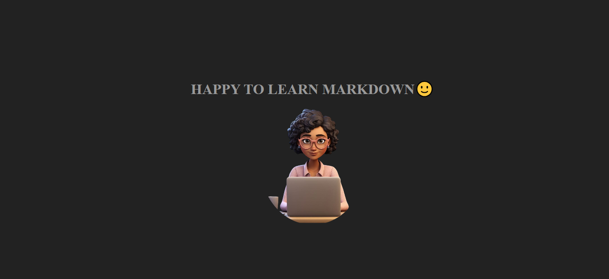

# A SIMPLE WEBSITE ABOUT MY PROFILE👊
## My simple website showcasing my profile as a developer💻


Lorem ipsum dolor sit amet consectetur, adipisicing elit.
     Consectetur dolore, illo est mollitia recusandae nam dignissimos dicta, 
     architecto corrupti, facilis sed eveniet odio. Ea eveniet accusamus laudantium 
     commodi, labore deserunt laborum sit quos odio sequi quo 
    inventore itaque natus qui repellat. Nisi perferendis accusamus deleniti.

## How to <mark>run</mark> this Project **Locally**😜
this is a __bold__ text

this text is *italics*

This project is like H<sub>2</sub>O. You can't do without it and growing like the function e<sup>x</sup> in maths

Please can you edit the footer but not the ~~navbar~~

```js
const x=4;
const y=3;
console.log(x+y);
```

## PYTHON CODE NOW
```python
def calculate(x,y);
   return x+y
```

## HOW TO CONTRIBUTE TO ANY PROJECT
### Follow the steps
- Fork
- Clone
- Push
- Pull request

1. #### To fork and clone:

- You can change repository name if you want
- create repository
- click on code
- copy link
- go to desktop, create new folder, open VS code, go to console, type; git clone, then rught click, press enter.

2. #### After contributing
 on Terminal;
 - git init
 - git add .
 - git commit -m ""
 - git log
 - git push

## Find Me😎

[Linkedln](https://linkedln.com)

[facebook](https://facebook.com)

[twitter](https://twitter.com)

## Project screenshot📷
